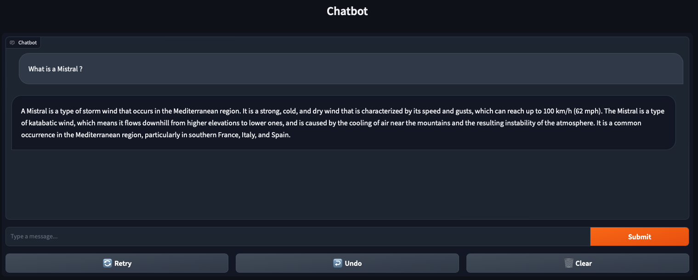

# Gradio Chatbot with Mistral 7B



This repository contains a Gradio chatbot application using the OpenAI API. The docker-compose contains the Gradio chatbot container and a vLLM container to use mistral 7B as backend for the chatbot.

## Prerequisites

- Docker

## Building the Docker container

To build the Docker container, run the following command in the terminal:

```bash
docker build --build-arg API_URL=<your_API_URL> --build-arg MODEL=<your_MODEL> -t gradio_chatbot .
```

Replace `<your_API_URL>` and `<your_MODEL>` with your OpenAI API URL, API key, and the model you want to use, respectively.

## Running the Docker container

To run the Docker container, use the following command:

This runs only the gradio container. To have a LLM plugged behind refer to the Docker Compose.

```bash
docker run -p 7860:7860 gradio_chatbot
```

The Gradio chatbot interface will be accessible at http://localhost:7860.

## Running the application using Docker Compose

Before running the containers using Docker Compose, make sure you have set the environment variables MODEL and HF_TOKEN. You can set them in a .env file or export them in your shell. API_URL is not required no more as it will be plugged to the vLLM container.
HF_TOKEN is required in order to download models from Hugging Face.

To build and run the containers using Docker Compose, execute the following command:

```bash
docker-compose up
```

Full example :
    
```bash
export MODEL="mistralai/Mistral-7B-Instruct-v0.1" 
export HF_TOKEN="YOUR_API_KEY"
docker-compose up
```

The Gradio chatbot interface will be accessible at http://localhost:7860. The Mistral-7B model will be running in a separate container and will communicate with the Gradio chatbot interface internally.

If your GPU has CUDA capabilities below 8.0, you will see the error ValueError: Bfloat16 is only supported on GPUs with compute capability of at least 8.0. Your XXX GPU has compute capability 7.0. You need to pass the parameter --dtype half to the Docker command line.
